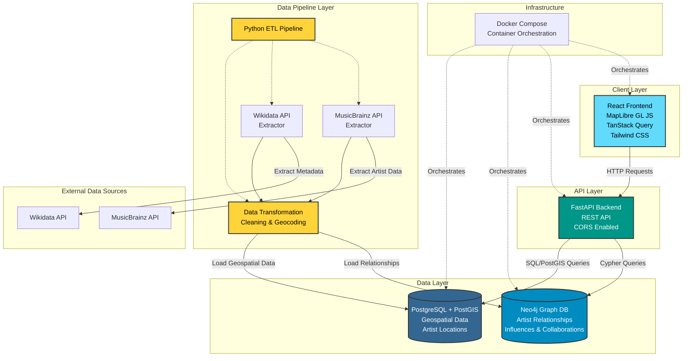

# Geosona Architecture

## System Overview

Geosona is a full-stack application for visualizing global music artist geography, influences, and collaborations on an interactive map.

## Architecture Diagram

